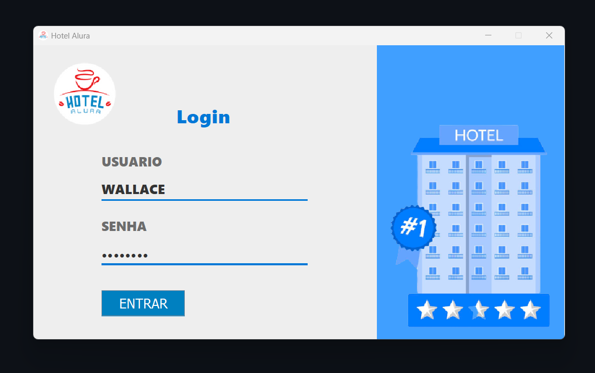
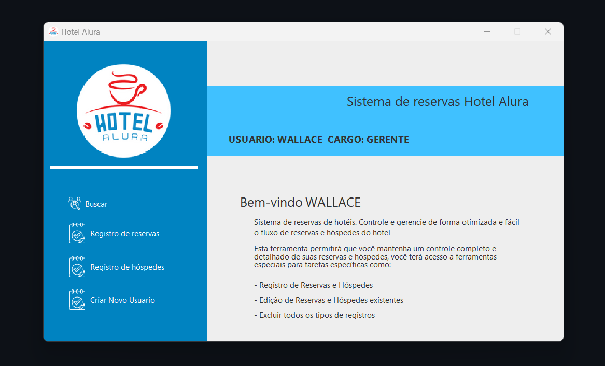
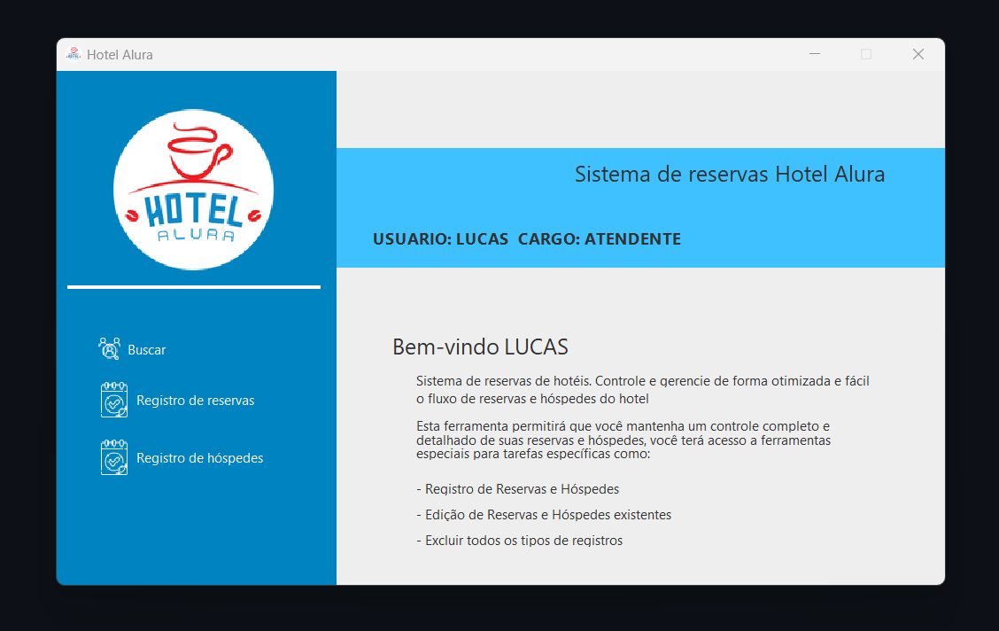
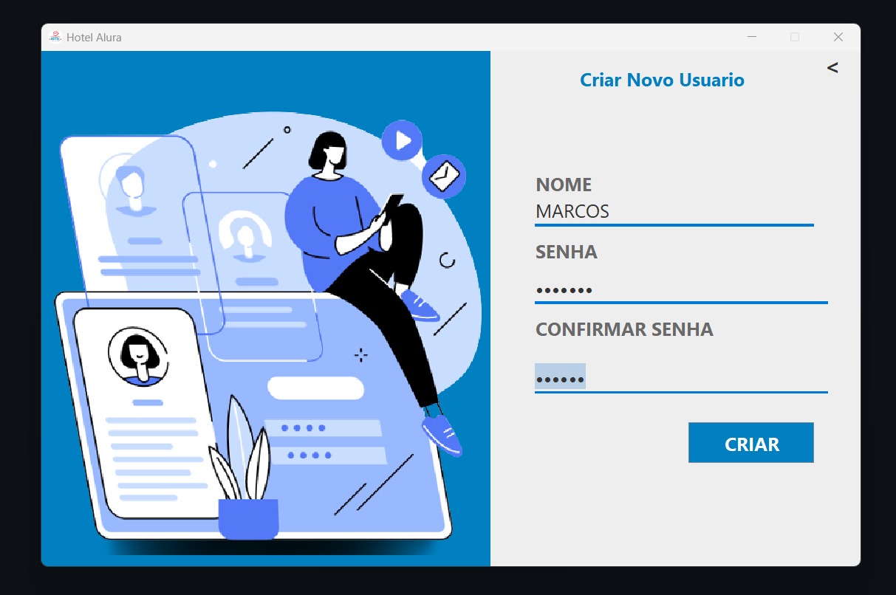
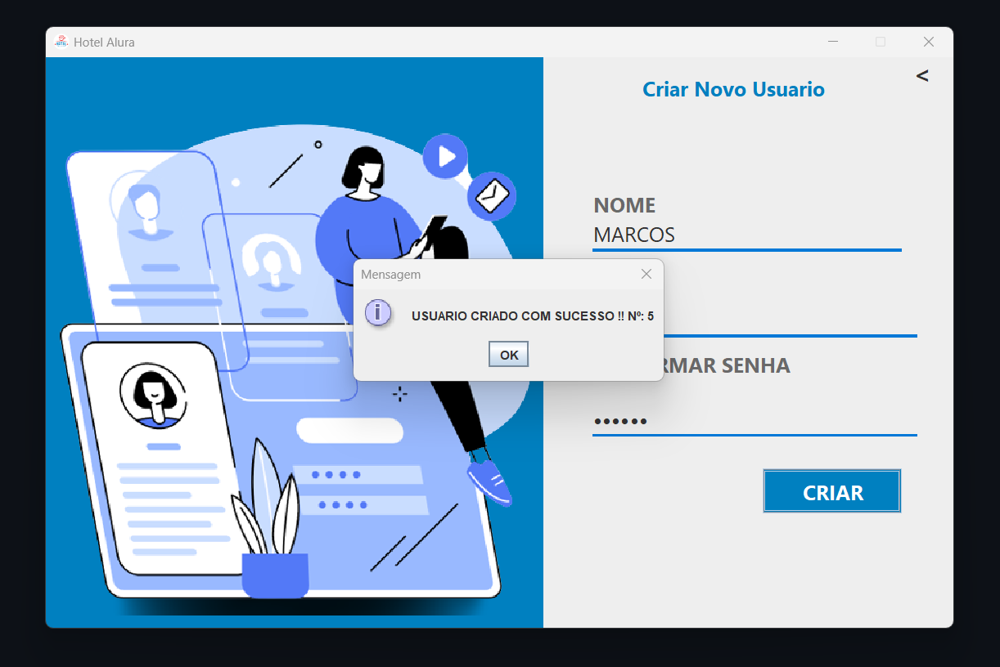
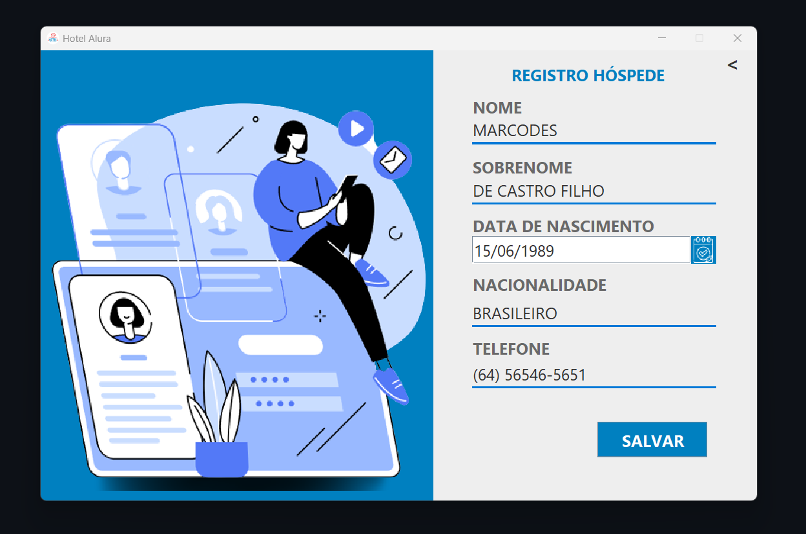
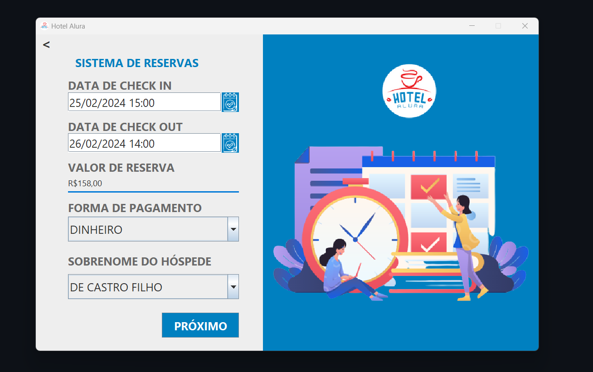
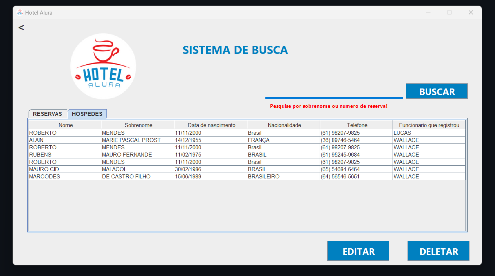
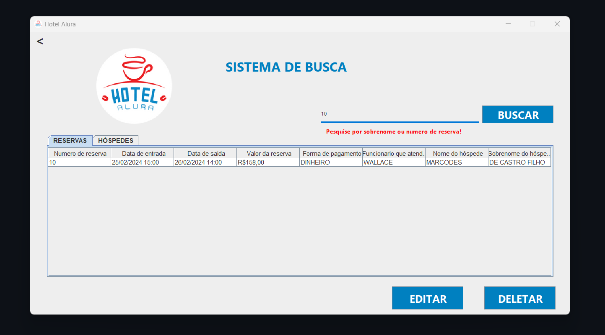
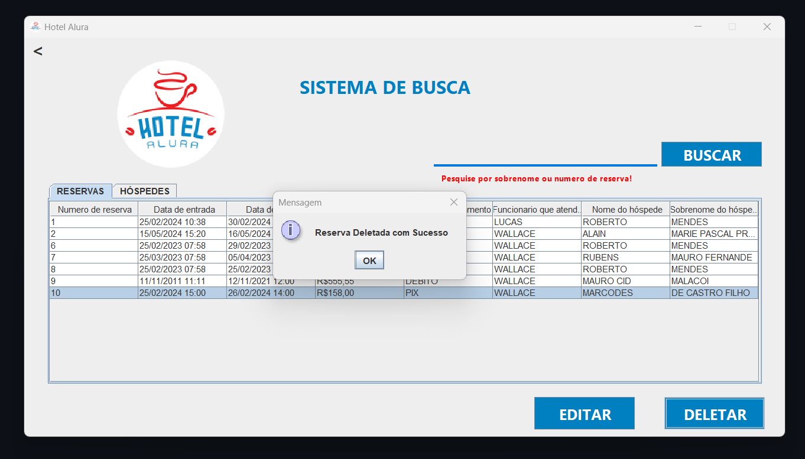

# SISTEMA DE RESERVAS DE HOTEL  | ONE - Oracle Next Education | Challenge Back End Java - HOTEL 
 Situação: Concluído! 

## Sobre o Projeto
---
- Resultado do Challenge Back End Java da ONE - Oracle Next Education
- Sistema de reservas de hotel 
## Funcionalidades 
#####  Login  
- Permite que o gerente crie usuários novos usuários
- O login do GERENTE é o único que pode criar novos usuários, usuário com cargo FUNCIONÁRIO não terão a funcionalidade de criar novos usuários
- As informações do usuário serão mostradas assim que o login for efetuado, mostrando nome e cargo
- Quando funcionário estiver logado todos os registro que forem criados por ele serão automaticamente vinculados ao usuário logado, Ex: funcionário abriu um reserva, na linha da reserva tera o nome do funcionário que a criou
#####  Registrar Hóspedes e Criar reserva: 
- Permite o usuário cadastrar Hóspedes e criar reservas, ao cadastrar um hóspede, esse hospede já estará disponível para se vinculado ao uma reserva que eventualmente possa ser criada
- Todos os locais de preenchimento estão com máscaras de formatações, para poder chegar no banco de dados informações mais padronizadas possíveis   
#####  Pesquisar: 
- Permite visualizar os hóspedes registrados e as reservas com todas as suas informações 
  Permite que seja pesquisada por padrão default ou caso queira pode pesquisar tanto hóspedes tanto reversa pelo sobrenome do hóspede, além de poder, pesquisar usando o número da reserva
- Permite a edição ou exclusão de informações, selecionando ela e clicando nos botões editar ou deletar.  


 ## Principais tecnologias utilizadas
````
 MySQL - Java - AWT - SWING - JDBC 
````
## Para iniciar: 
---
♦ Utilize o executável 
<p align="center" >
     
</p>

## Imagem Previa 
---
♦ Primeira Janela 
<p align="center" >
     
</p>
♦ Tela de Login
<p align="center" >
     
</p>
♦ Tela do GERENTE mostrando Nome, Cargo e a opção Criar Novo Usuário
<p align="center" >
     
</p>
♦ Tela do FUNCIONÁRIO mostrando Nome, Cargo, mas sem a opção de Criar Novo Usuário
<p align="center" >
     
</p>


♦ No caso de escolher: Criar Novo Usuário  
<p align="center" >
     
</p>

<p align="center" >
     
</p>

♦ No caso de escolher: Registro de hóspedes
<p align="center" >
     
</p>

<p align="center" >
     
</p>

♦ No caso de escolher: Registro de reservas 
<p align="center" >
     
</p>

<p align="center" >
     
</p>

♦ No caso de escolher: Buscar 
<p align="center" >
     
</p>


♦ Resposta ao buscar por: Default 
<p align="center" >
     
</p>

<p align="center" >
     
</p>
♦ Resposta ao buscar por: Numero de reserva
<p align="center" >
     
</p>

♦ Resposta ao buscar por: Sobrenome 
<p align="center" >
     
</p>

<p align="center" >
     
</p>

♦ Resposta Ao editar informação
<p align="center" >
     
</p>
♦ Resposta Ao Excluir informação
<p align="center" >
     
</p>
## Informações sobre o Banco de Dados 
---
♦ Modelo Conceitual
<p align="center" >
     
</p>

♦ Modelo Logico
<p align="center" >
     
</p>

- Todo banco esta disponível nos arquivos 


Badge pela Conclusão do Desafio
---
► link aqui
<p align="center" >

</p>
